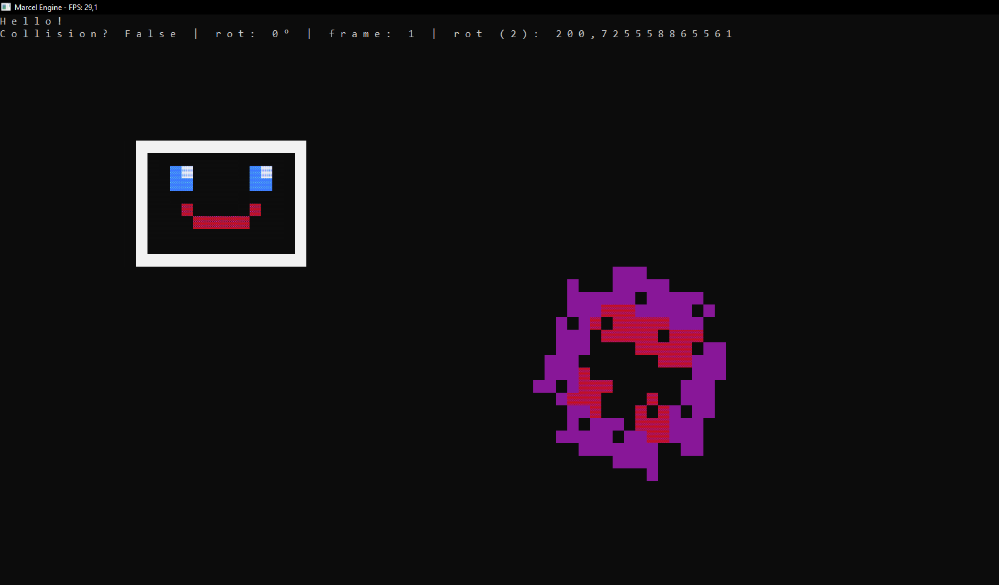

# Marcel-Engine
A C# Console Project (.NET Framework 4.7.1 rn) Game Engine.

The Documentation is here: https://github.com/marceldobehere/Marcel-Engine/blob/main/Documentation.md

Sprite Generator at https://github.com/marceldobehere/Marcel-Engine-Sprite-Generator

A Packaging Kit is here https://github.com/marceldobehere/Marcel-Engine-Packaging-Kit So you can package your games into a single file!

## Images

